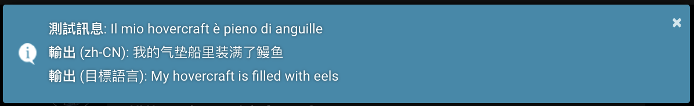

# Chat Translation

## Overview

The Chat Translation Extension enables real-time translation of chat messages between
different languages using various translation providers. It supports both manual and
automatic translation modes.


 
+++ English

+++ 简体中文

+++ 繁體中文

+++ 한국어

+++ Русский

+++

## Usage

All the ways to translate chat messages:

**<i class="fa-solid fa-language"></i> Translate Chat** button in the **<i class="fa-solid fa-magic-wand-sparkles"></i>
Extensions** menu

- Translates the entire chat history at once

**<i class="fa-solid fa-keyboard"></i> Translate Input** button in the **<i class="fa-solid fa-magic-wand-sparkles"></i>
Extensions** menu

- Translates just the current input text
- Useful before sending a message

**<i class="fa-solid fa-language"></i> Translate Message** icon in the **<i class="fa-solid fa-ellipsis"></i> Message Actions**
toolbar of any message

- Click to translate just that message
- Click again to revert to original text

**Auto-mode** configuration in the **Chat Translation** drawer of the **<i class="fa-solid fa-cubes"></i>
Extensions** panel

- Automatically translates user inputs, AI responses, or both

**/translate** slash command

- Use `/translate [target=language_code] text` to translate text

## Configuration

Configuration options are available in the **Chat Translation** drawer of the **<i class="fa-solid fa-cubes"></i>
Extensions** panel.

#### Provider

- Choose your preferred [translation service](#translation-providers)
- Click the **<i class="fa-solid fa-key"></i> API Key** icon, if it appears, to enter an API key
- Click the **<i class="fa-solid fa-link"></i> Custom URL** icon, if it appears, to enter a custom API URL

#### Target Language

Select the language you want to write your messages in, or read AI responses in.

#### Auto-mode

Configure automatic translation behavior.

- **None**: No automatic translation
- **Translate responses**: Automatically translates AI responses into the target language
- **Translate inputs**: Automatically translates user inputs into English
- **Translate both**: Translates both user inputs and AI responses

#### Clear Translations

The **<i class="fa-solid fa-trash-can"></i> Clear Translations** button removes all translations from messages in the
current chat. The original messages are preserved.

### Configuration Example: Chinese to English Chatting

To set up a workflow where a Chinese-speaking user can chat in Chinese with an AI that operates in English:

1. Set Auto-mode to "Translate both"
2. Set Target Language to "Chinese (Simplified)" or "Chinese (Traditional)"
3. Choose a translation provider with good language auto-detection (e.g., Google or DeepL)

This setup will:

- Translate user's Chinese input to English for the AI
- Translate AI's English responses back to Chinese for the user

This setup relies on automatic language detection for input. For more precise control, future updates may include
explicit source language selection.

## Translation providers

**:icon-cloud:** Cloud-based
**<i class="fa-solid fa-link"></i>** Local, custom URL
**<i class="fa-solid fa-key"></i>** Requires API key

| Provider                                                            | Location                                                                      | Features                                                                                               |
|---------------------------------------------------------------------|-------------------------------------------------------------------------------|--------------------------------------------------------------------------------------------------------|
| [Libre Translate](https://libretranslate.com/)                      | :icon-cloud: <i class="fa-solid fa-key"></i> <i class="fa-solid fa-link"></i> | Self-hosted (AGPL-3.0) alternative to proprietary translation services, with cloud-hosted Pro tier     | 
| [Google Translate](https://cloud.google.com/translate)              | :icon-cloud:                                                                  | Widely used, supports many languages, good accuracy                                                    |
| [Lingva Translate](https://lingva.ml/)                              | <i class="fa-solid fa-link"></i>                                              | Alternative front-end for Google Translate, open source (AGPL-3.0), privacy-focused                    |
| [DeepL](https://www.deepl.com/)                                     | :icon-cloud: <i class="fa-solid fa-key"></i>                                  | High-quality translations, especially for European languages                                           |
| [DeepLX](https://github.com/OwO-Network/DeepLX)                     | <i class="fa-solid fa-link"></i>                                              | Self-hosted DeepL proxy, open source (MIT), free but proxying DeepL Pro requires DeepL API key         |
| [Bing Translator](https://www.bing.com/translator)                  | :icon-cloud:                                                                  | Microsoft's translation service, integrates with Azure services                                        |
| [OneRing Translator](https://github.com/janvarev/OneRingTranslator) | <i class="fa-solid fa-link"></i>                                              | Self-hosted front-end to Google Translate and other providers, privacy-focused, open source (AGPL-3.0) |
| [Yandex Translate](https://translate.yandex.com/)                   | :icon-cloud:                                                                  | Good for Russian and Eastern European languages                                                        |

### DeepL-specific configuration

- Formality levels available for German, French, Italian, Spanish, Dutch, Japanese, and Russian
- Configure via `deepl.formality` in [config.yaml](/Administration/config-yaml.md#deepl-configuration)

## Slash Commands

Use `/translate` command for quick translations. Syntax: `/translate [target=language_code] text`. If target language is
not provided, the value from the extension settings will be used.   

### Basic usage

Translate text to the current target language and show it in a popup:

```
/translate Welcome to the Tavern | /echo 
```


Translate text to Spanish and add it to the chat:

```
/translate target=es Hello world | /send
```


### Testing, pipeline translation, localization

Prompt the user for a message and a language, translate the message into that language, then re-translate it into the
configured target language and show both translations in a popup. This example uses the `/input` and `/buttons` commands to
gather user input:

```shell
/input default="Hello, world!" <span data-i18n="Test Message">Sample text</span> | 
/let key=input ||
/buttons labels=["zh-CN", "zh-TW", "es", "hu", "en"] <span data-i18n="UI Language">Language</span> | 
/let key=lang ||
/translate target={{var::lang}} {{var::input}} | /let key=tx_target | 
/translate | /let key=tx_orig ||
/echo escapeHtml=false cssClass=wider_dialogue_popup
<b data-i18n="Test Message">Test message</b>: {{var::input}} <br/>
<b data-i18n="Output">Output</b> ({{var::lang}}): {{var::tx_target}} <br/>
<b data-i18n="Output">Output</b> (<span data-i18n="ext_translate_target_lang">target language</span>): {{var::tx_orig}} <br/>
```

This is useful for checking the quality of a translation into a language that you don't speak, before writing it
somewhere important.


The UI controls are shown in the current locale, independent of the configured target language.

| `/input`                                                                                        | `/buttons`                                                                          |
|-------------------------------------------------------------------------------------------------|-------------------------------------------------------------------------------------|
|  |  |


Input language detection is relatively effective in the following examples:




## Technical Notes

- UTF-8 encoding, special characters, and emojis are supported
- Handles large messages by splitting into chunks when needed
- Preserves formatting and embedded images in messages
- Caches translations to avoid redundant API callschecking

### AI input language

`internal_language` controls the language into which user messages are auto-translated before being sent to the AI. It is hardcoded to 'en' in the default settings and cannot be changed through the UI. Thus, the translation target language for messages *to the AI* is always English. Previous testing showed that AI performance was better when receiving English messages, but this may change as more LLMs are being trained on more varied language data. I suppose one could change `internal_language` in `settings.json` and find out.

### Chinese variant handling

The extension supports both Simplified and Traditional Chinese, but not all translation providers do. The UI presents these as 'Chinese (Simplified)' and 'Chinese (Traditional)' respectively, with language codes 'zh-CN' and 'zh-TW'. They are mapped to the following language codes for translation providers:

* Libre Translate: 'zh-CN' to 'zh' and 'zh-TW' to 'zt'.
* DeepL and DeepLX: both variants to 'ZH'.
* Bing: 'zh-CN' to 'zh-Hans', 'zh-TW' as-is.
* Other providers use 'zh-CN' and 'zh-TW' as provided.

### Text length limits

Some providers have character limits per request:

- Yandex: 5000 characters
- DeepLX: 1500 characters
- Bing: 1000 characters
- Google: 5000 characters

Longer texts are automatically split into chunks for translation.
